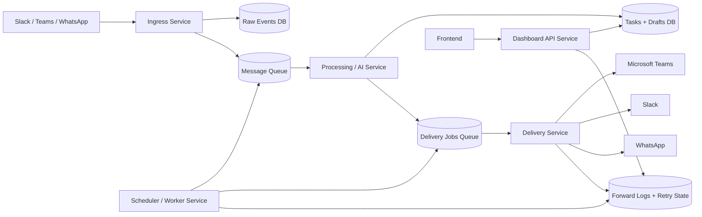

# Unified Hub Microservice Flow

This file explains how to split the current monolith into stable microservices with async processing and retries.

## High-Level Flowchart

## Service Responsibilities

- **Ingress Service**
  - Receives webhook events from Slack, Teams, WhatsApp.
  - Verifies signatures and normalizes payloads.
  - Stores raw events and publishes queue messages.

- **Processing / AI Service**
  - Reads inbound events from queue.
  - Runs extraction/classification/OpenClaw logic.
  - Produces tasks/drafts and emits delivery jobs.

- **Delivery Service**
  - Sends outbound messages/files to Teams/Slack/WhatsApp.
  - Handles provider-specific errors and retries.
  - Writes forward logs and delivery status.

- **Dashboard API Service**
  - Single API for frontend reads/writes.
  - Serves drafts, messages, tasks, and logs.
  - Does not execute scanner/forwarding jobs directly.

- **Scheduler / Worker Service**
  - Runs timed jobs (batch scans, reminders, retry loops).
  - Enqueues work only; avoids direct coupling to channel APIs.

## Key Stability Rules

- Use queue-based async boundaries between services.
- Add idempotency keys for every inbound and outbound event.
- Use correlation IDs to trace a message across all services.
- Keep retries in Delivery/Worker, not in API routes.
- Keep each service deployable independently.

## Suggested Execution Phases

1. Extract `worker-service` (batch scan + reminders + retries).
2. Extract `delivery-service` (Teams/Slack/WhatsApp senders).
3. Extract `ai-service` (OpenClaw analysis + task extraction).
4. Keep current backend as `dashboard-api` until cutover.
5. Move webhook routes into `ingress-service` and connect queue.

